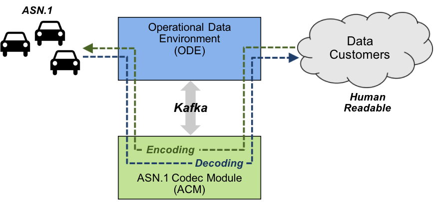

# Abstract Syntax Notation One (ASN.1) Codec Module for the Operational Data Environment (ODE)

The ASN.1 Codec Module (ACM) processes Kafka data streams that preset [ODE
Metadata](https://github.com/usdot-jpo-ode/jpo-ode/blob/develop/docs/metadata_standards.md) wrapped ASN.1 data.  It can perform
one of two functions depending on how it is started:

1. **Decode**: This function is used to process messages *from* the connected
vehicle environment *to* ODE subscribers. Specifically, the ACM extacts binary
data from consumed messages (ODE Metatdata Messages) and decodes the binary
ASN.1 data into a structure that is subsequently encoded into an alternative
format more suitable for ODE subscribers (currently XML using XER).

1. **Encode**: This function is used to process messages *from* the ODE *to*
the connected vehicle environment. Specifically, the ACM extracts
human-readable data from ODE Metadata and decodes it into a structure that
is subsequently *encoded into ASN.1 binary data*.



# Table of Contents

1. [Release Notes](#release-notes)
1. [Getting Involved](#getting-involved)
1. [Documentation](#documentation)
1. [Installation](docs/installation.md)
1. [Configuration and Operation](docs/configuration.md)
1. [Interface](docs/interface.md)
1. [Testing](docs/testing.md)
1. [Project Management](#project-management)

# Release Notes

- ODE-537/581/584/585/586/537: ASN.1 codec module development and integration. 

# Getting Involved

This project is sponsored by the U.S. Department of Transportation and supports Operational Data Environment data type
conversions. Here are some ways you can start getting involved in this project:

- **Pull the code and check it out!**  The ASN.1 Codec project uses the [Pull Request Model](https://help.github.com/articles/using-pull-requests).
    - Github has [instructions](https://help.github.com/articles/signing-up-for-a-new-github-account) for setting up an account and getting started with repositories.
- If you would like to improve this code base or the documentation, [fork the project](https://github.com/usdot-jpo-ode/asn1_codec#fork-destination-box) and submit a pull request.
- If you find a problem with the code or the documentation, please submit an [issue](https://github.com/usdot-jpo-ode/asn1_codec/issues/new).

## Introduction

This project uses the [Pull Request Model](https://help.github.com/articles/using-pull-requests). This involves the following project components:

- The usdot-jpo-ode organization project's [master branch](https://github.com/usdot-jpo-ode/asn1_codec).
- A personal GitHub account.
- A fork of a project release tag or master branch in your personal GitHub account.

A high level overview of our model and these components is as follows. All work will be submitted via pull requests.
Developers will work on branches on their personal machines (local clients), push these branches to their **personal GitHub repos** and issue a pull
request to the organization asn1_codec project. One the project's main developers must review the Pull Request and merge it
or, if there are issues, discuss them with the submitter. This will ensure that the developers have a better
understanding of the code base *and* we catch problems before they enter `master`. The following process should be followed:

## Initial Setup

1. If you do not have one yet, create a personal (or organization) account on GitHub (assume your account name is `<your-github-account-name>`).
1. Log into your personal (or organization) account.
1. Fork [asn1_codec](https://github.com/usdot-jpo-ode/asn1_codec/fork) into your personal GitHub account.
1. On your computer (local client), clone the master branch from you GitHub account:
```bash
$ git clone https://github.com/<your-github-account-name>/asn1_codec.git
```

## Additional Resources for Initial Setup
  
- [About Git Version Control](http://git-scm.com/book/en/v2/Getting-Started-About-Version-Control)
- [First-Time Git Setup](http://git-scm.com/book/en/Getting-Started-First-Time-Git-Setup)
- [Article on Forking](https://help.github.com/articles/fork-a-repo)

# Documentation

This documentation is in the `README.md` file. Additional information can be found using the links in the [Table of
Contents](#table-of-contents).  All stakeholders are invited to provide input to these documents. Stakeholders should
direct all input on this document to the JPO Product Owner at DOT, FHWA, or JPO. 

## Code Documentation

Code documentation can be generated using [Doxygen](https://www.doxygen.org) by following the commands below:

```bash
$ sudo apt install doxygen
$ cd <install root>/asn1_codec
$ doxygen
```

The documentation is in HTML and is written to the `<install root>/asn1_codec/docs/html` directory. Open `index.html` in a
browser.  

## Project Management

This project is managed using the Jira tool.

- [Jira Project Portal](https://usdotjpoode.atlassian.net/secure/Dashboard.jsp)

